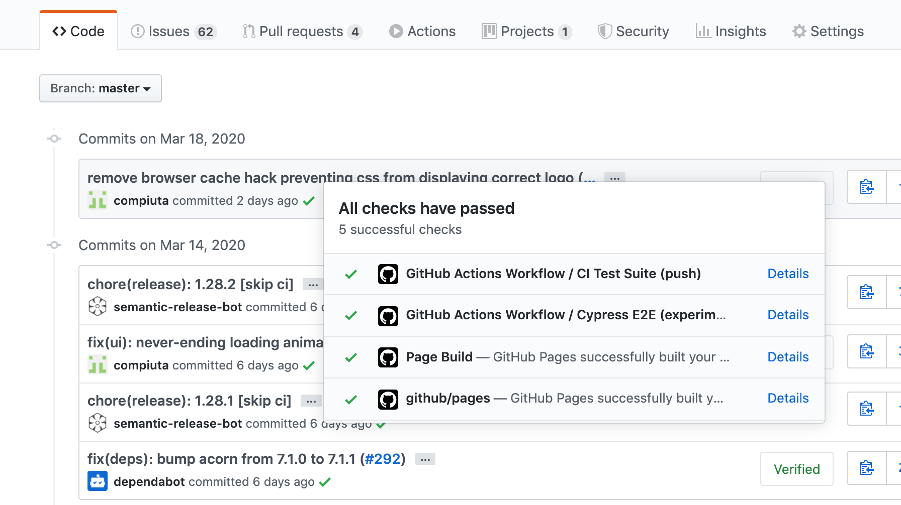
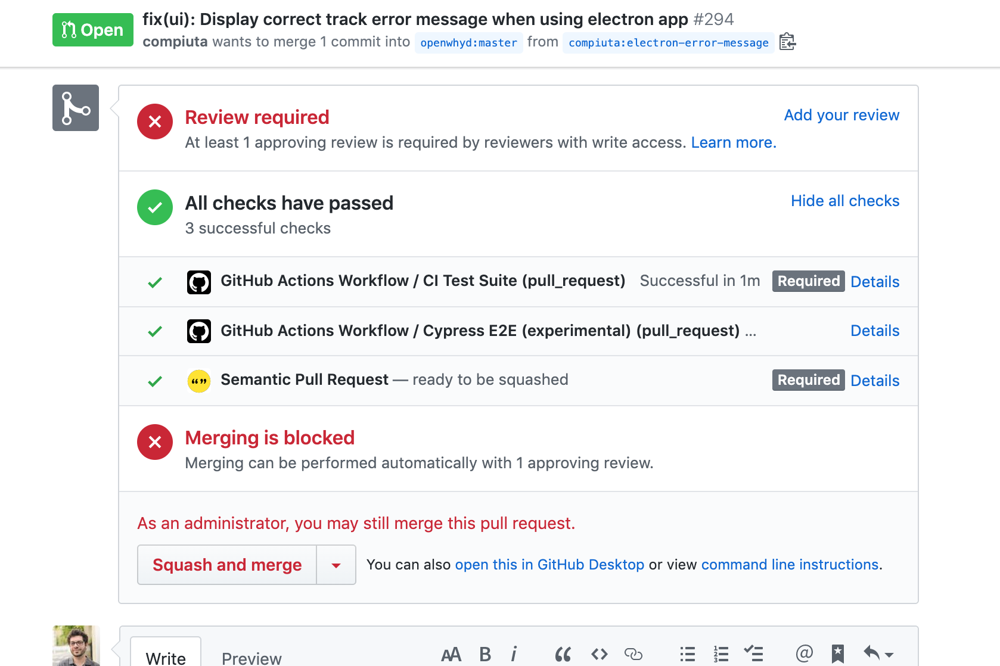

<!--
Programme de la première partie:
- placer les étudiants pour faciliter l'entraide et la facilité d'accès aux étudiants les plus en difficulté.
- corriger exercices à rendre en faisant intervenir les étudiants
- consolidation des acquis: terminologie et concepts (templates/vues, utilisation d'API, émettre une requête HTTP depuis Node.js, gestion d'erreurs)
- répondre aux questions des étudiants
- QCM
- correction du QCM
- effectuer/commencer les exercices de cette séance (4)
-->

## Objectifs de cette séance

Afin de savoir développer et maintenir une application Node.js de manière pérenne, nous allons:

- Écrire des tests automatisés: unitaires, d'intégration et fonctionnels
- Mettre en place un processus d'intégration continue avec GitHub Actions

Durée estimée: TBD.

## Pré-requis

Pour effectuer ces exercices, assurez-vous que les pré-requis suivants sont bien installés et accessibles depuis votre terminal Bash (ou compatible):
- `node`; (tester avec `$ node --version`)
- et `git`. (vérifier que `$ git config --global user.email` retourne bien votre adresse email d'étudiant·e)

---

## Introduction

La plupart des applications sont amenées à fonctionner pendant plusieurs années. L'évolution des besoins des utilisateurs, des entreprises, ainsi que l'évolution des technologies et des normes de sécurité implique que le code source de ces applications devra être modifié régulièrement. Notamment pour y ajouter des fonctionnalités et corriger des bugs. Afin d'éviter que la **maintenance** d'un programme ne devienne de plus en plus coûteuse et risquée, il faut suivre quelques règles d'hygiène, parmi lesquelles: définir des tests.

Pour vérifier que les fonctionnalités d'un programme se comportent **comme prévu**, il est possible de le tester "à la main". C'est à dire: d'interagir manuellement avec ce programme, via son (ou ses) interface(s). Par exemple, dans le cas d'un site statique, il suffit de consulter le site à l'aide de plusieurs navigateurs, et d'explorer ses pages pour s'assurer que le contenu s'affiche comme prévu. Dans le cas d'un site dynamique -- ou pire: d'un site dynamique avec compte utilisateurs -- il y a beaucoup plus de cas à tester. Il faut en effet vérifier que les procédure de création de compte utilisateur, d'identification et d'oubli de mot de passe fonctionnent bien, mais aussi que les informations stockées en base de données ne sont visibles qu'aux utilisateurs qui sont sensés y avoir accès.

L'écriture de **tests automatisés** permet de définir une fois pour toutes cette liste de vérifications à mener, pour vérifier qu'un site (ou programme) fonctionne comme prévu.

Il existe trois grandes catégories de tests:
- les **tests unitaires** permettent de vérifier les fonctions définies dans le code source;
- les **tests fonctionnels** permettent de vérifier le bon fonctionnement du site (ou programme) dans son ensemble, comme un utilisateur pourrait le faire manuellement;
- enfin, les **tests d'intégration** permettent de vérifier le bon comportement de plusieurs composants définis à l'intérieur du programme.

---

## Exercice 4.1 - Premier test automatisé avec Ava

Le but de cet exercice est de compléter le site dynamique que nous avons créé dans la partie précédente, afin d'y intégrer des tests automatisés.

### Objectifs

- Fonctionnel: La commande `npm test` doit permettre d'exécuter notre test fonctionnel, et celui-ci doit seulement "passer" si la route `/ville` de notre serveur web fonctionne comme défini dans les exercices 3.x.
- Lisibilité: Suivre les conventions de codage du [guide de style de Airbnb](https://github.com/airbnb/javascript): chaînes de caractères entre apostrophes, indentation à 2 espaces, usage de point-virgules pour ponctuer chaque instruction.
- Structure: Respecter la structure de fichiers générée par `express-generator` + ajouter un fichier `test.js` qui contiendra notre test fonctionnel.
- Production: (non nécessaire à ce stade)

### Étapes proposées

Ces étapes sont décrites moins précisément que celles fournies dans les exercices précédents. Utilisez les ressources disponibles sur Internet pour vous aider: documentation de Node.js, des modules npm utilisés, examples, tutos, etc...

1. Ajouter le moteur de tests "[Ava](https://www.npmjs.com/package/ava)" à notre projet Node.js.
2. Créer `test.js` et y définir un test fonctionnel qui vérifiera que la page d'index du site comprend bien un formulaire HTML.
3. Compléter `package.json` et `README.md` afin d'expliquer comment exécuter ce test.
4. Ajouter à `test.js` un test fonctionnel ou d'intégration qui vérifiera que la page "ville" contient bien le nom de la ville qui lui a été passé en paramètre POST.
5. Versionner le code avec `$ git tag v4.1` puis le pousser vers le dépôt distant que vous avez créé pendant la séance précédente.

---

## Exercice 4.2 - Ajout de tests automatisés

### Objectifs

La commande `npm test` exécutera le test réalisé dans l'exercice précédent ainsi que trois nouveaux tests définis ci-dessous.

### Étapes proposées

Dans le même dépôt:

1. Ajouter un test fonctionnel ou d'intégration pour vérifier que la page de destination affiche bien un message d'erreur quand on cherche une ville qui n'existe pas.
2. Ajouter un test fonctionnel ou d'intégration pour vérifier que la page de destination affiche bien un message d'erreur dans le cas où l'API `geocode.xyz` retourne un code `404`.
3. Ajouter une fonction `cleanCityName()` dans le module `ville.js` et quelques tests unitaires pour vérifier son bon fonctionnement.
4. Versionner le code avec `$ git tag v4.2` puis le pousser vers le dépôt distant que vous avez créé pendant la séance précédente.

Pro tip: Vous pouvez utiliser le module [`nock`](https://www.npmjs.com/package/nock) dans vos tests d'intégration pour intercepter et modifier les réponses de l'API externe `geocode.xyz`.

### BONUS

Dans l'application "chatbot" développée dans la partie 1 du cours, ajouter un test d'intégration pour vérifier que toute nouvelle information fournie par l'utilisateur via l'endpoint `POST /chat` est bien stockée dans `réponses.json`.

---

## Exercice 4.3 - Mise en place d'intégration continue avec GitHub Actions

L'intégration continue est un ensemble de pratiques permettant de développer de manière plus rapide et robuste. Elle vise notamment à prévenir les régressions, c'est à dire les modifications de code qui introduisent des défauts là où il n'y en avait pas.

Pour prévenir ces régressions, nous allons mettre en place un processus qui exécutera automatiquement nos tests automatisés à chaque fois que nous enverrons des changements de code à notre dépôt distant. (c.a.d. `git commit` suivi de `git push`)

Pour cela, nous allons configurer [GitHub Actions](https://github.com/features/actions), le système d'intégration continue mis à disposition gratuitement par GitHub.

### Objectifs

GitHub Actions exécutera les tests automatisés des exercices précédents et nous informera des résultats:

- à chaque fois qu'un `commit` sera intégré à la branche `master` de votre dépôt distant hébergé sur github.com, (exemple: coches vertes sur [liste de commits](https://github.com/openwhyd/openwhyd/commits/master))

  

- et à chaque fois qu'un "pull request" sera créé (ou mis à jour) dans ce dépôt. (exemple: cliquer sur "Show all checks", en bas de ce [pull request](https://github.com/openwhyd/openwhyd/pull/294))

  

---

## Pour aller plus loin

Ressources sur la maintenabilité, les tests et la sécurité:

- Concept à comprendre pour surveiller la maintenabilité du code: la [dette technique](https://fr.wikipedia.org/wiki/Dette_technique)
- [Integration Continue](https://fr.wikipedia.org/wiki/Int%C3%A9gration_continue): exécuter ses tests automatisés dans le cloud. Exemples de services: [Circle CI](https://circleci.com/).
