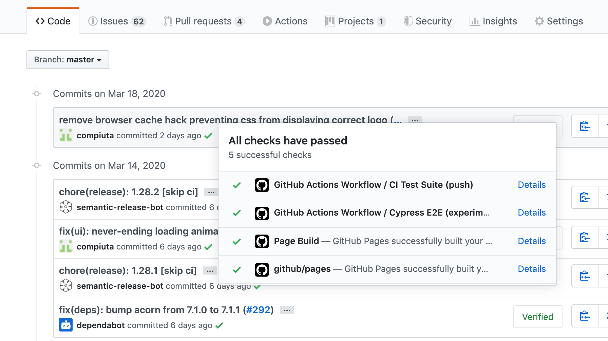
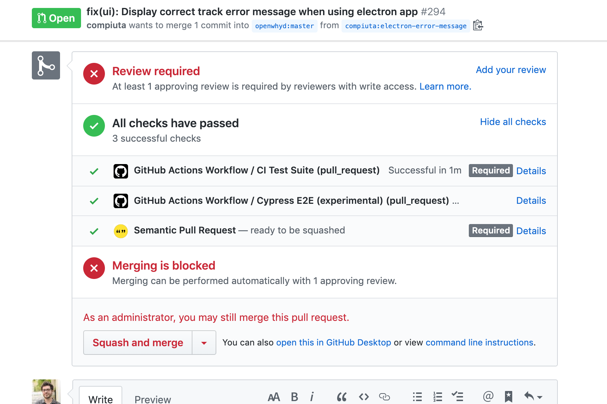

<!--
Programme de la première partie:
- placer les étudiants pour faciliter l'entraide et la facilité d'accès aux étudiants les plus en difficulté.
- corriger exercices à rendre en faisant intervenir les étudiants
- consolidation des acquis: terminologie et concepts (templates/vues, utilisation d'API, émettre une requête HTTP depuis Node.js, gestion d'erreurs)
- répondre aux questions des étudiants
- QCM
- correction du QCM
- effectuer/commencer les exercices de cette séance (4)
-->

## Objectifs de cette partie

Afin de savoir développer et maintenir une application Node.js de manière pérenne, nous allons:
- Écrire des tests automatisés: unitaires, d'intégration et de bout en bout
- Utiliser des outils pour formater et nous aider à améliorer notre code
- Mettre en place un processus d'intégration continue avec GitHub Actions

Prérequis:
- Définition et appel de fonctions synchrones et asynchrones
- Importation et installation de modules internes et externes
- Méthode de résolution de problèmes

Durée estimée: 4 heures.

## Pré-requis

Pour effectuer ces exercices, assurez-vous que les pré-requis suivants sont bien installés et accessibles depuis votre shell Linux:
- `node` version 10 ou plus; (tester avec `$ node --version`)
- et `git`. (vérifier que `$ git config --global user.email` retourne bien votre adresse email d'étudiant·e)

---

## Introduction

La plupart des applications sont amenées à fonctionner pendant plusieurs années. L'évolution des besoins des utilisateurs, des entreprises, ainsi que l'évolution des technologies et des normes de sécurité implique que le code source de ces applications devra être modifié régulièrement. Notamment pour y ajouter des fonctionnalités et corriger des bugs. Afin d'éviter que la **maintenance** d'un programme ne devienne de plus en plus coûteuse et risquée, il faut suivre quelques règles d'hygiène, parmi lesquelles: tester régulièrement l'application.

Pour vérifier que les fonctionnalités d'un programme se comportent **comme prévu**, il est possible de le tester "à la main". C'est à dire: d'interagir manuellement avec ce programme, via son (ou ses) interface(s). Par exemple, dans le cas d'un site statique, il suffit de consulter le site à l'aide de plusieurs navigateurs, et d'explorer ses pages pour s'assurer que le contenu s'affiche comme prévu. Dans le cas d'un site dynamique -- ou pire: d'un site dynamique avec compte utilisateurs -- il y a beaucoup plus de cas à tester. Il faut en effet vérifier que les procédure de création de compte utilisateur, d'identification et d'oubli de mot de passe fonctionnent bien, mais aussi que les informations stockées en base de données ne sont visibles qu'aux utilisateurs qui sont sensés y avoir accès.

L'écriture de **tests automatisés** permet de définir une fois pour toutes cette liste de vérifications à mener, pour vérifier qu'un site (ou programme) fonctionne comme prévu, sans avoir à effectuer d'opérations manuelles répétitives.

Il existe trois grandes catégories de tests:
- les **tests unitaires** permettent de vérifier les fonctions définies dans le code source;
- les **tests de bout en bout** permettent de vérifier le bon fonctionnement du site (ou programme) dans son ensemble, comme un utilisateur pourrait le faire manuellement;
- enfin, les **tests d'intégration** permettent de vérifier le bon comportement de plusieurs composants définis à l'intérieur du programme.

---

## Exercice 1 - Des tests pour vérifier la conformité

Consultez le fichier [7-complete.spec.js](https://github.com/adrienjoly/cours-nodejs-techio-2/blob/master/nodejs-project/7-complete.spec.js). (en cliquant sur le lien)

Il s'agit d'une suite de tests conçue pour être exécutée par le framework de tests "[Mocha](https://mochajs.org/)". (on peut également le qualifier de _test runner_ ou _test driver_)

Commencez par observer attentivement le titre donné à chaque test, et la manière dont ces titres ont été formulés.

Puis répondez aux questions suivantes:

- Reconnaissez-vous ces tests ?
- Déterminez le type de chaque test (unitaire, intégration ou de bout en bout), et expliquez pourquoi.
- Dans cette suite de tests, qu'est-ce qui nous permet de reconnaître les tests de bout en bout ?
- Est-ce que un ou plusieurs types de tests manquent ? Pourquoi, d'après vous ?
- Quel aurait été l'intérêt de regrouper toutes les assertions dans un même test ?
- Inversement, quel est l'intérêt d'avoir écrit des tests séparés ?
- A quoi sert le module `expect.js` ?
- Quelles fonctions sont fournies par `expect.js` ?
- Que veut dire `.to.eql()` ? Pourquoi l'a-t-on utilisé à la place de `.to.equal()` ?
- Aurait-on pu se passer de `expect.js` / utiliser un autre module ? Dans quel intérêt ?

---

## Exercice 2 - Des tests pour éviter les régressions

Dans l'exercice 1, nous avons vu un premier exemple de suite de tests automatisés permettant de vérifier la conformité de programmes avec des exigences fonctionnelles et techniques. Dans cet exemple, les tests ont été conçus pour être les plus agnostiques possibles quant à la manière d'écrire le code testé.

Nous allons maintenant voir d'autres exemples de tests automatisés, pour une finalité différente: éviter les régressions qui pourraient être apportées par les contributeurs d'un projet open source.

Consultez le code source du projet [Openwhyd](https://github.com/openwhyd/openwhyd) puis répondez aux questions suivantes:

- Citez un exemple de test unitaire inclus dans ce projet.
  - Quels indices permettent de reconnaître qu'il s'agit d'un test unitaire ?
  - Quel modules sont utilisés pour écrire et exécuter ce test ?
- Citez un exemple de test d'intégration inclus dans ce projet.
  - Quels indices permettent de reconnaître qu'il s'agit d'un test d'intégration ?
  - Quel modules sont utilisés pour écrire et exécuter ce test ?
- Citez un exemple de test de bout en bout inclus dans ce projet.
  - Quels indices permettent de reconnaître qu'il s'agit d'un test de bout en bout ?
  - Quel modules sont utilisés pour écrire et exécuter ce test ?

---

## Exercice 3 - Écrire des tests unitaires

Dans cet exercice, vous allez définir puis implémenter quelques tests unitaires, afin de vérifier le fonctionnement attendu de la fonction JavaScript suivante:

```js
// La fonction somme() retourne la somme des nombres passés en paramètre.
// Tout paramètre manquant aura 0 comme valeur par défaut.
// Si un des paramètre n'est pas de type `number`, la fonction lèvera une
// exception avec le message d'erreur "paramètre invalide".
function somme(nombre1, nombre2) {
  // (implémentation de la fonction: non nécessaire pour cet exercice)
}
```

Étapes:

1. En vous appuyant sur la signature de la fonction `somme()` et de sa documentation fournie en commentaires, proposer 3 intitulés de tests unitaires pour cette fonction, en respectant la forme suivante:

    > _Avec les valeurs de paramètres `X` et `Y`,_  
    > _la fonction `somme()` est sensée retrourner la valeur `Z`_
    
    Remplacer `X`, `Y` et `Z` par de vraies valeurs.

2. Après avoir formulé en français ces trois intitulés, implémenter les tests unitaires correspondants en JavaScript, dans un fichier `test.js`, de manière à ce qu'ils soient compréhensibles par [Mocha](https://mochajs.org/).

3. Dans le même fichier, ajouter la fonction `somme()` fournie ci-dessus, telle quelle. Exécuter la suite de tests avec Mocha. Tous les tests devraient échouer, car la fonction n'est pas encore implémentée.

4. Compléter l'implémentation de la fonction `somme()` de manière à ce qu'elle fonctionne comme prévu. Vérifier que tous les tests passent, désormais.

5. Si ce n'est pas encore fait, initialiser puis compléter le fichier `package.json` pour que n'importe quel autre développeur puisse lancer vos tests depuis sa machine, en tapant seulement les commandes `npm install` et `npm test`.

---

## Exercice 4 - Écrire un test de bout en bout

Dans cet exercice, vous allez définir puis implémenter un test de bout en bout pour vérifier le bon fonctionnement d'une des routes du chatbot que nous avons développé dans la partie 1 du cours.

Dans ce contexte, il est approprié d'employer un test de bout en bout car ce test pourrait très bien être effectué manuellement par n'importe quel utilisateur de votre API, sans nécessiter d'accès au code source de cette API. Par contre, pour que votre test puisse fonctionner, il faudra que l'API soit active, prête à répondre aux requêtes.

Voici l'intitulé du test que vous allez implémenter: _Quand le chatbot reçoit une requête HTTP GET à la racine (/), il répond "Bonjour !"_.

Implémenter ce test, le lancer avec Mocha et vérifier qu'il passe quand votre serveur de chatbot est actif.

---

## Exercice 5 - Outils pour améliorer la qualité du code

Plus le code est simple et lisible, plus il sera facile à maintenir. Plus le code est facile à maintenir, moins il sera vulnérable aux bugs, dans la durée.

Dans cet exercice, vous allez installer 3 outils qui vont vous aider à améliorer la qualité de votre code:
- [ESLint](https://eslint.org/) permet de prévenir les erreurs courantes (ex: utiliser un simple égal dans l'expression d'une condition `if`);
- [Prettier](https://prettier.io/) permet de formater et indenter votre code automatiquement;
- et [TypeScript](https://www.typescriptlang.org/) permet (dans un premier temps) de réduire le risque que vous fassiez des erreurs de typage.

Étapes à effectuer dans le répertoire de l'exercice précédent:

1. Installez ESLint à l'aide de la commande `$ npx eslint --init`, en choisissant les options suivantes:

  - How would you like to use ESLint? **To check syntax and find problems**
  - What type of modules does your project use? **CommonJS (require/exports)**
  - Which framework does your project use? **None of these**
  - Does your project use TypeScript? **No**
  - Where does your code run? **Node**
  - What format do you want your config file to be in? **JavaScript**
  - Would you like to install them now with npm? **Yes**

2. Exécutez ESLint sur vos fichiers JS (`$ npx eslint *.js`) puis appliquez les modifications suggérées pour améliorer votre code.

  > Si ESLint ne suggère aucune modification dans votre code, causez volontairement un problème: utilisez un `=` au lieu de l'opérateur d'égalité `===` employé dans une des conditions `if` de `server.js`, sauvegardez puis relancez la commande.

3. Installez Prettier: `$ npm install --save-dev prettier`

4. Demandez à Prettier de lister les lignes qui mériteraient d'être mises en forme: `$ npx prettier server.js | diff server.js -`

5. Demandez à Prettier de mettre en forme (reformater) vos fichiers JS: `$ npx prettier --write *.js`

6. Pour éviter que les règles de ESLint n'entrent en conflit avec celles de Prettier, installez la configuration `eslint-config-prettier` en suivant [ces instructions](https://github.com/prettier/eslint-config-prettier#installation)

7. Installez TypeScript: `$ npm install --save-dev typescript` puis `$ $(npm bin)/tsc --init`

8. Exécutez TypeScript (`$ $(npm bin)/tsc`) pour voir s'il y a erreurs de types à corriger dans votre code JavaScript

  > Vous devrez paramétrer les [options](https://www.typescriptlang.org/docs/handbook/compiler-options.html) suivantes dans `tsconfig.json`:
  > - `allowJs: true` et `checkJs: true`, pour que `tsc` valide vos fichiers JS
  > - `noEmit: true`, pour que `tsc` liste les anomalies dans la sortie standard
  > - `noImplicitAny: false`, pour que `tsc` ne s'attende pas à ce que vous spécifiez le type des paramètres de vos fonctions. 

9. Modifiez `package.json` de manière à ce qu'il suffise de taper `npm run check` pour afficher les suggestions de ESLint, Prettier et TypeScript

10. BONUS: Installez l'éditeur de code [Visual Studio Code](https://code.visualstudio.com/), ouvrez le répertoire de l'exercice, puis configurez le _workspace_ de votre projet de manière à ce que:

  - les erreurs ESLint et TypeScript soient visibles directement depuis la fenêtre d'édition du code de `server.js`,
  - et que le fichier `server.js` soit automatiquement mis en forme par Prettier à chaque fois que vous le sauvegardez.

---

## Exercice 6 - Mise en place d'intégration continue avec GitHub Actions

L'intégration continue est un ensemble de pratiques permettant de développer de manière plus rapide et robuste. Elle vise notamment à prévenir les régressions – c'est à dire les modifications de code qui introduisent des défauts là où il n'y en avait pas – de manière continue.

Pour prévenir ces régressions, nous allons mettre en place un processus qui exécutera automatiquement nos tests automatisés à chaque fois que nous enverrons des changements de code à notre dépôt distant. (c.a.d. `git commit` suivi de `git push`)

Pour cela, nous allons configurer [GitHub Actions](https://github.com/features/actions), le système d'intégration continue mis à disposition gratuitement par GitHub.

### Objectifs

GitHub Actions exécutera la suite de tests automatisés de l'exercice 3 et nous informera des résultats:

- à chaque fois qu'un `commit` sera intégré à la branche `master` de votre dépôt distant hébergé sur github.com, (exemple: coches vertes sur [liste de commits](https://github.com/openwhyd/openwhyd/commits/master))

<p align="center">
  
</p>

- et à chaque fois qu'un "pull request" sera créé (ou mis à jour) dans ce dépôt. (exemple: cliquer sur "Show all checks", en bas de ce [pull request](https://github.com/openwhyd/openwhyd/pull/294))

<p align="center">
  
</p>

---

## Pour aller plus loin

Ressources sur la maintenabilité, les tests et l'Artisanat Logiciel (_Software Crafts(wo)manship_):

- Concept à comprendre pour surveiller la maintenabilité du code: la [dette technique](https://fr.wikipedia.org/wiki/Dette_technique)
- [Integration Continue](https://fr.wikipedia.org/wiki/Int%C3%A9gration_continue): exécuter ses tests automatisés dans le cloud. Exemples de services: [Circle CI](https://circleci.com/).
- Vidéo: [The #1 way to improve your code](https://www.youtube.com/watch?v=0czUk0j6zLg) (une bonne introduction à la méthode TDD - Test-Driven Development)
- Vidéo: [L’Artisanat Logiciel, par Yannick Grenzinger](https://www.youtube.com/watch?v=FzIuAImNcis)

Références sur les outils de qualité de code:

- [How to setup ESLint and Prettier on Node – SourceLevel](https://sourcelevel.io/blog/how-to-setup-eslint-and-prettier-on-node)
- [Setting up efficient workflows with ESLint, Prettier and TypeScript - JavaScript inDepth](https://indepth.dev/setting-up-efficient-workflows-with-eslint-prettier-and-typescript/)
- [TypeScript: Handbook - Migrating from JavaScript](https://www.typescriptlang.org/docs/handbook/migrating-from-javascript.html)
