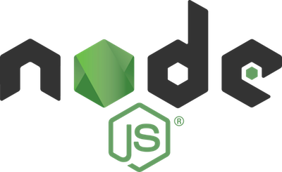

# Cours Node.js

<!--

## Ressources pour l'enseignant

- schémas capturés au tableau: https://github.com/adrienjoly/cours-nodejs/issues/8
- correcteurs d'exercices: https://github.com/adrienjoly/cours-nodejs-exercise-testers
- solutions d'exercices: https://github.com/adrienjoly/cours-nodejs-exercise-solutions
- évals et exams: https://github.com/adrienjoly/cours-nodejs-student-evaluations
- template pour projet: https://github.com/adrienjoly/cours-nodejs-project-tester
- solution pour projet: https://github.com/adrienjoly/cours-nodejs-project-solution

-->

## Objectifs pédagogiques

- Découvrir la plateforme Node.js, comme alternative à PHP pour développer un back-end web moderne
- Savoir développer, tester et mettre en production un serveur Node.js
- Maîtriser la programmation asynchrone (callbacks, promises et async/await) et quelques fonctions incontournables fournies par Node.js: console, fs (filesystem)...
- Installer et utiliser des modules npm: express.js, node-fetch et mongo
- Savoir résoudre des problèmes techniques de manière autonome, en pratiquant une méthodologie structurante par petits groupes de travail ([_mob programming_](annexes/mob-programming.md))
- Applications: création d’un chatbot, d'une API et d’une application web connectée à une base de données NoSQL

## Supports de cours et exercices

- [Partie 1 - Chat-bot en production avec Express et Heroku](01-chatbot/)
- [Partie 2 - Programmation asynchrone et requête à d'autres APIs](02-async/)
- [Partie 3 - Utilisation du système de fichiers](03-fs/)
- [Partie 4 - Persistance de données avec MongoDB](04-db/)
- [Partie 5 - Validation, tests automatisés et intégration continue](05-valid/)
- Partie 6 - Identification, autorisation et authentification

<!-- TODO: utiliser Firebase au lieu de MongoDB -->
<!-- Idée: une partie à propos d'infrastructure (load balancer...) et de limitation de requêtes (rate limiter) -->

## Annexes

- [Méthode de résolution de problèmes](annexes/problem-solving.md)
- [Pratiquer en groupe, grâce au _Mob Programming_](annexes/mob-programming.md)

## Logiciels utilisés

- Node.js + npm
- `git`
- `curl`
- MongoDB

## Pré-requis

Ce cours a été conçu pour des étudiants ayant déjà écrit des programmes en JavaScript, (cf [cours JavaScript](https://adrienjoly.com/cours-javascript)) et connaissant l'usage de base de `git`. (cf [cours `git`](https://adrienjoly.com/cours-git))

## Notes sur la conception et méthode pédagogique

Centrées sur la pratique, les séances sont majoritairement constituées d'exercices à effectuer à plusieurs (cf [_Mob Programming_](annexes/mob-programming.md)), entrecoupés d'explications données par l'intervenant. Le but est de faire vivre chaque problème aux étudiants avant de donner des explications, pour les encourager à chercher par eux-mêmes, et rendre les explications plus motivantes à suivre.

Les étudiants sont encouragés à s'entraider par l'usage d'un canal de communication partagé (ex: Slack, Mattermost ou autre). Outre l'intérêt de ne pas rester bloqué pendant des heures sur un problème, ce type de communication permet aux étudiants d'apprendre à observer la situation problématique à laquelle ils font face, de prendre le temps d'en chercher les causes potentielles, et de décrire le problème de manière synthétique mais précise. Et donc de développer à la fois leur autonomie et leur esprit d'entraide, compétences indispensables pour des développeurs professionnels.

## A propos de l'auteur

Passionné par la programmation depuis son enfance, Adrien Joly est ingénieur logiciel depuis 2007. Il a contribué à plusieurs projets de recherche et développement (chez Gemalto, Alcatel-Lucent Bell Labs et Algolia), a dirigé le développement de la start-up Whyd dont il maintient toujours le produit (devenu "[Openwhyd](https://openwhyd.org)" en 2016), et a développé plusieurs applications web en tant que freelance et entrepreneur indépendant.

Parallèlement, et depuis 2015, Adrien donne des cours de développement logiciel dans plusieurs écoles parisiennes.

Enfin, depuis Mars 2020, Adrien propose des prestations de développement et de conseil "craft" via l'ESN "<a href="https://shodo.io/">SHODO</a>".

Pour plus d'infos, consulter ma [page pro](/pro).

## Références du cours

- [JavaScript language reference - DevDocs](https://devdocs.io/javascript/)
- [Node.js API](https://nodejs.org/api)
- [npm](https://www.npmjs.com/) (Node Package Manager)
- [MongoDB Node.JS Driver](https://mongodb.github.io/node-mongodb-native/)
- [Heroku](https://heroku.com) (Cloud hosting)

## Ressources pédagogiques alternatives

- Meetups (rencontres ouvertes) de la communauté Node.js et JavaScript à Paris:
  - [Node.js Paris](https://www.meetup.com/fr-FR/Nodejs-Paris)
  - [Paris.js](https://www.meetup.com/fr-FR/Paris-js/)
- [JS Books](http://jsbooks.revolunet.com/)
- Workshops de [NodeSchool](https://nodeschool.io/fr-fr/#workshoppers):
  - [workshopper/learnyounode](https://github.com/workshopper/learnyounode): Learn You The Node.js For Much Win! An intro to Node.js via a set of self-guided workshops.
  - [azat-co/expressworks](https://github.com/azat-co/expressworks): Learn Express.js from the author of one of the best books on Express.js.
  - [evanlucas/learnyoumongo](https://github.com/evanlucas/learnyoumongo): MongoDB workshop.
- Tutos de FreeCodeCamp:
  - [Basic Node and Express](https://learn.freecodecamp.org/apis-and-microservices/basic-node-and-express/)
  - [Managing Packages with Npm](https://learn.freecodecamp.org/apis-and-microservices/managing-packages-with-npm/)
  - [MongoDB and Mongoose](https://learn.freecodecamp.org/apis-and-microservices/mongodb-and-mongoose/)
- [How to create a REST API with Express.js in Node.js - RWieruch](https://www.robinwieruch.de/node-express-server-rest-api/)
- [Learn Node.js and MongoDB by building a URL Shortener app](https://freshman.tech/url-shortener/)
- [leonardomso/33-js-concepts: 📜 33 concepts every JavaScript developer should know.](https://github.com/leonardomso/33-js-concepts)
- [19 ways to become a better Node.js developer in 2019](https://medium.com/@me_37286/19-ways-to-become-a-better-node-js-developer-in-2019-ffd3a8fbfe38)
- [Linting ES2015+ — ESLint with StyleGuides: Google, AirBnB, Common](https://medium.com/@uistephen/style-guides-for-linting-ecmascript-2015-eslint-common-google-airbnb-6c25fd3dff0)

## Ressources annexes au cours

- [When debugging, your attitude matters - Julia Evans](https://jvns.ca/blog/debugging-attitude-matters/)
- [Apprendre à apprendre: deux modes d’apprentissage](http://www.internetactu.net/2015/09/08/apprendre-a-apprendre-14-deux-modes-dapprentissage/)
- [Startup Noob Guide](http://bit.ly/startupnoob)
